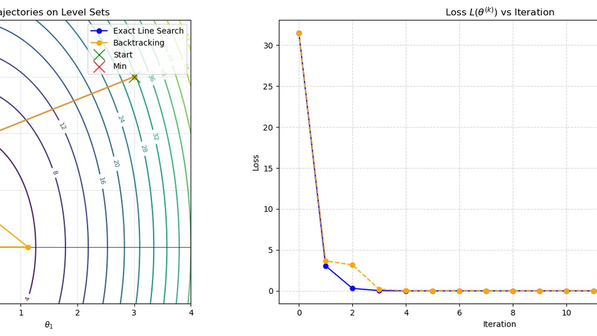

# Machine Learning desde cero

[](https://skillicons.dev)

Los fundamentos del machine learning implementados a mano con NumPy, en cuatro notebooks.



## Qué hace

- Descenso de gradiente: búsqueda de paso con backtracking y comparación con el paso óptimo.
- Descenso de gradiente estocástico aplicado a un problema real de regresión.
- Regresión logística con métricas de evaluación y fronteras de decisión.
- SVD, compresión de imágenes, PCA y clustering sobre MNIST.

## Cómo ejecutarlo

```bash
pip install numpy pandas matplotlib scikit-learn scikit-image jupyter
jupyter notebook
```

El último notebook necesita el dataset MNIST de Kaggle, que se descarga aparte.

## Contenido

| Fichero | Qué es |
|---|---|
| `Homework 1 Gradient Descent.ipynb` | Descenso de gradiente |
| `Homework 2/` | SGD y dataset `insurance.csv` |
| `Homework 3/` | Aprendizaje supervisado y dataset `diabetes.csv` |
| `Homework 4/` | Aprendizaje no supervisado |

---

Ejercicios del Máster en Inteligencia Artificial, Università di Bologna (Erasmus+). Forma parte de mi [portfolio](https://quique-such.github.io/portafolio/).
